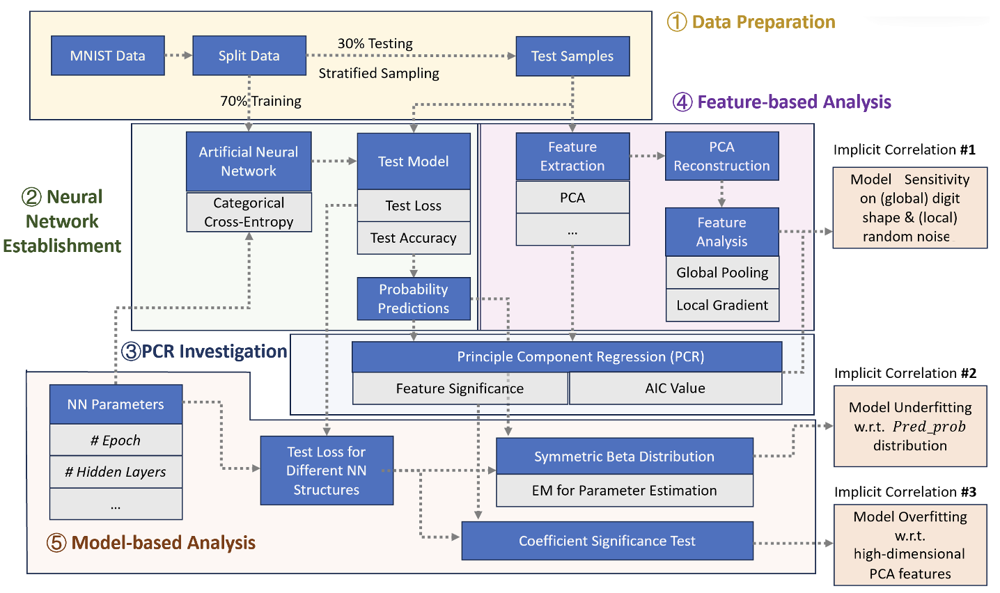

```{r setup, include=FALSE}
knitr::opts_chunk$set(echo = TRUE)
library(tidyverse)
library(caret)
library(MASS)
library(car)
library(ggplot2)
library(dplyr)
```


Here is the workflow of this project.



## Load dataset

In this section, we load the datasets for digit 2,5,8,9 with different amount of PCA features. For each dataset, we normalized the scores to [0,1].

```{r}
# Load the dataset

d1 <- read.csv("dataset/pca_data_1_d2.csv")
d2 <- read.csv("dataset/pca_data_2_d2.csv") 
d3 <- read.csv("dataset/pca_data_3_d2.csv") 
d4 <- read.csv("dataset/pca_data_5_d2.csv") 
d5 <- read.csv("dataset/pca_data_10_d2.csv") 
d6 <- read.csv("dataset/pca_data_20_d2.csv") 
d7 <- read.csv("dataset/pca_data_40_d2.csv")
d8 <- read.csv("dataset/pca_data_50_d2.csv") 
d9 <- read.csv("dataset/pca_data_60_d2.csv") 
d10 <- read.csv("dataset/pca_data_80_d2.csv") 
d11 <- read.csv("dataset/pca_data_100_d2.csv") 
d12 <- read.csv("dataset/pca_data_120_d2.csv") 
d13 <- read.csv("dataset/pca_data_140_d2.csv")
d14 <- read.csv("dataset/pca_data_150_d2.csv") 
d15 <- read.csv("dataset/pca_data_160_d2.csv") 
d16 <- read.csv("dataset/pca_data_180_d2.csv") 
d17 <- read.csv("dataset/pca_data_200_d2.csv") 
d18 <- read.csv("dataset/pca_data_250_d2.csv") 
d19 <- read.csv("dataset/pca_data_300_d2.csv")
d20 <- read.csv("dataset/pca_data_350_d2.csv")
d21 <- read.csv("dataset/pca_data_400_d2.csv")

# Normalize each feature to the range [0, 1]
nd1 <- d1 %>%
  mutate(across(starts_with("f"), ~ (.-min(.)) / (max(.) - min(.))))
nd2 <- d2 %>%
  mutate(across(starts_with("f"), ~ (.-min(.)) / (max(.) - min(.))))
nd3 <- d3 %>%
  mutate(across(starts_with("f"), ~ (.-min(.)) / (max(.) - min(.))))
nd4 <- d4 %>%
  mutate(across(starts_with("f"), ~ (.-min(.)) / (max(.) - min(.))))
nd5 <- d5 %>%
  mutate(across(starts_with("f"), ~ (.-min(.)) / (max(.) - min(.))))
nd6 <- d6 %>%
  mutate(across(starts_with("f"), ~ (.-min(.)) / (max(.) - min(.))))
nd7 <- d7 %>%
  mutate(across(starts_with("f"), ~ (.-min(.)) / (max(.) - min(.))))
nd8 <- d8 %>%
  mutate(across(starts_with("f"), ~ (.-min(.)) / (max(.) - min(.))))
nd9 <- d9 %>%
  mutate(across(starts_with("f"), ~ (.-min(.)) / (max(.) - min(.))))
nd10 <- d10 %>%
  mutate(across(starts_with("f"), ~ (.-min(.)) / (max(.) - min(.))))
nd11 <- d11 %>%
  mutate(across(starts_with("f"), ~ (.-min(.)) / (max(.) - min(.))))
nd12 <- d12 %>%
  mutate(across(starts_with("f"), ~ (.-min(.)) / (max(.) - min(.))))
nd13 <- d13 %>%
  mutate(across(starts_with("f"), ~ (.-min(.)) / (max(.) - min(.))))
nd14 <- d14 %>%
  mutate(across(starts_with("f"), ~ (.-min(.)) / (max(.) - min(.))))
nd15 <- d15 %>%
  mutate(across(starts_with("f"), ~ (.-min(.)) / (max(.) - min(.))))
nd16 <- d16 %>%
  mutate(across(starts_with("f"), ~ (.-min(.)) / (max(.) - min(.))))
nd17 <- d17 %>%
  mutate(across(starts_with("f"), ~ (.-min(.)) / (max(.) - min(.))))
nd18 <- d18 %>%
  mutate(across(starts_with("f"), ~ (.-min(.)) / (max(.) - min(.))))
nd19 <- d19 %>%
  mutate(across(starts_with("f"), ~ (.-min(.)) / (max(.) - min(.))))
nd20 <- d20 %>%
  mutate(across(starts_with("f"), ~ (.-min(.)) / (max(.) - min(.))))
nd21 <- d21 %>%
  mutate(across(starts_with("f"), ~ (.-min(.)) / (max(.) - min(.))))

nd_list_d2 <- list(nd1, nd2, nd3, nd4, nd5, nd6, nd7, nd8, nd9, nd10, nd11, nd12, nd13, nd14,nd15,nd16,nd17,nd18,nd19,nd20,nd21)

```

```{r}
# Load the dataset

d1 <- read.csv("dataset/pca_data_1_d5.csv")
d2 <- read.csv("dataset/pca_data_2_d5.csv") 
d3 <- read.csv("dataset/pca_data_3_d5.csv") 
d4 <- read.csv("dataset/pca_data_5_d5.csv") 
d5 <- read.csv("dataset/pca_data_10_d5.csv") 
d6 <- read.csv("dataset/pca_data_20_d5.csv") 
d7 <- read.csv("dataset/pca_data_40_d5.csv")
d8 <- read.csv("dataset/pca_data_50_d5.csv") 
d9 <- read.csv("dataset/pca_data_60_d5.csv") 
d10 <- read.csv("dataset/pca_data_80_d5.csv") 
d11 <- read.csv("dataset/pca_data_100_d5.csv") 
d12 <- read.csv("dataset/pca_data_120_d5.csv") 
d13 <- read.csv("dataset/pca_data_140_d5.csv")
d14 <- read.csv("dataset/pca_data_150_d5.csv") 
d15 <- read.csv("dataset/pca_data_160_d5.csv") 
d16 <- read.csv("dataset/pca_data_180_d5.csv") 
d17 <- read.csv("dataset/pca_data_200_d5.csv") 
d18 <- read.csv("dataset/pca_data_250_d5.csv") 
d19 <- read.csv("dataset/pca_data_300_d5.csv")
d20 <- read.csv("dataset/pca_data_350_d5.csv")
d21 <- read.csv("dataset/pca_data_400_d5.csv")

# Normalize each feature to the range [0, 1]
nd1 <- d1 %>%
  mutate(across(starts_with("f"), ~ (.-min(.)) / (max(.) - min(.))))
nd2 <- d2 %>%
  mutate(across(starts_with("f"), ~ (.-min(.)) / (max(.) - min(.))))
nd3 <- d3 %>%
  mutate(across(starts_with("f"), ~ (.-min(.)) / (max(.) - min(.))))
nd4 <- d4 %>%
  mutate(across(starts_with("f"), ~ (.-min(.)) / (max(.) - min(.))))
nd5 <- d5 %>%
  mutate(across(starts_with("f"), ~ (.-min(.)) / (max(.) - min(.))))
nd6 <- d6 %>%
  mutate(across(starts_with("f"), ~ (.-min(.)) / (max(.) - min(.))))
nd7 <- d7 %>%
  mutate(across(starts_with("f"), ~ (.-min(.)) / (max(.) - min(.))))
nd8 <- d8 %>%
  mutate(across(starts_with("f"), ~ (.-min(.)) / (max(.) - min(.))))
nd9 <- d9 %>%
  mutate(across(starts_with("f"), ~ (.-min(.)) / (max(.) - min(.))))
nd10 <- d10 %>%
  mutate(across(starts_with("f"), ~ (.-min(.)) / (max(.) - min(.))))
nd11 <- d11 %>%
  mutate(across(starts_with("f"), ~ (.-min(.)) / (max(.) - min(.))))
nd12 <- d12 %>%
  mutate(across(starts_with("f"), ~ (.-min(.)) / (max(.) - min(.))))
nd13 <- d13 %>%
  mutate(across(starts_with("f"), ~ (.-min(.)) / (max(.) - min(.))))
nd14 <- d14 %>%
  mutate(across(starts_with("f"), ~ (.-min(.)) / (max(.) - min(.))))
nd15 <- d15 %>%
  mutate(across(starts_with("f"), ~ (.-min(.)) / (max(.) - min(.))))
nd16 <- d16 %>%
  mutate(across(starts_with("f"), ~ (.-min(.)) / (max(.) - min(.))))
nd17 <- d17 %>%
  mutate(across(starts_with("f"), ~ (.-min(.)) / (max(.) - min(.))))
nd18 <- d18 %>%
  mutate(across(starts_with("f"), ~ (.-min(.)) / (max(.) - min(.))))
nd19 <- d19 %>%
  mutate(across(starts_with("f"), ~ (.-min(.)) / (max(.) - min(.))))
nd20 <- d20 %>%
  mutate(across(starts_with("f"), ~ (.-min(.)) / (max(.) - min(.))))
nd21 <- d21 %>%
  mutate(across(starts_with("f"), ~ (.-min(.)) / (max(.) - min(.))))

nd_list_d5 <- list(nd1, nd2, nd3, nd4, nd5, nd6, nd7, nd8, nd9, nd10, nd11, nd12, nd13, nd14,nd15,nd16,nd17,nd18,nd19,nd20,nd21)

```

```{r}
# Load the dataset

d1 <- read.csv("dataset/pca_data_1_d8.csv")
d2 <- read.csv("dataset/pca_data_2_d8.csv") 
d3 <- read.csv("dataset/pca_data_3_d8.csv") 
d4 <- read.csv("dataset/pca_data_5_d8.csv") 
d5 <- read.csv("dataset/pca_data_10_d8.csv") 
d6 <- read.csv("dataset/pca_data_20_d8.csv") 
d7 <- read.csv("dataset/pca_data_40_d8.csv")
d8 <- read.csv("dataset/pca_data_50_d8.csv") 
d9 <- read.csv("dataset/pca_data_60_d8.csv") 
d10 <- read.csv("dataset/pca_data_80_d8.csv") 
d11 <- read.csv("dataset/pca_data_100_d8.csv") 
d12 <- read.csv("dataset/pca_data_120_d8.csv") 
d13 <- read.csv("dataset/pca_data_140_d8.csv")
d14 <- read.csv("dataset/pca_data_150_d8.csv") 
d15 <- read.csv("dataset/pca_data_160_d8.csv") 
d16 <- read.csv("dataset/pca_data_180_d8.csv") 
d17 <- read.csv("dataset/pca_data_200_d8.csv") 
d18 <- read.csv("dataset/pca_data_250_d8.csv") 
d19 <- read.csv("dataset/pca_data_300_d8.csv")
d20 <- read.csv("dataset/pca_data_350_d8.csv")
d21 <- read.csv("dataset/pca_data_400_d8.csv")

# Normalize each feature to the range [0, 1]
nd1 <- d1 %>%
  mutate(across(starts_with("f"), ~ (.-min(.)) / (max(.) - min(.))))
nd2 <- d2 %>%
  mutate(across(starts_with("f"), ~ (.-min(.)) / (max(.) - min(.))))
nd3 <- d3 %>%
  mutate(across(starts_with("f"), ~ (.-min(.)) / (max(.) - min(.))))
nd4 <- d4 %>%
  mutate(across(starts_with("f"), ~ (.-min(.)) / (max(.) - min(.))))
nd5 <- d5 %>%
  mutate(across(starts_with("f"), ~ (.-min(.)) / (max(.) - min(.))))
nd6 <- d6 %>%
  mutate(across(starts_with("f"), ~ (.-min(.)) / (max(.) - min(.))))
nd7 <- d7 %>%
  mutate(across(starts_with("f"), ~ (.-min(.)) / (max(.) - min(.))))
nd8 <- d8 %>%
  mutate(across(starts_with("f"), ~ (.-min(.)) / (max(.) - min(.))))
nd9 <- d9 %>%
  mutate(across(starts_with("f"), ~ (.-min(.)) / (max(.) - min(.))))
nd10 <- d10 %>%
  mutate(across(starts_with("f"), ~ (.-min(.)) / (max(.) - min(.))))
nd11 <- d11 %>%
  mutate(across(starts_with("f"), ~ (.-min(.)) / (max(.) - min(.))))
nd12 <- d12 %>%
  mutate(across(starts_with("f"), ~ (.-min(.)) / (max(.) - min(.))))
nd13 <- d13 %>%
  mutate(across(starts_with("f"), ~ (.-min(.)) / (max(.) - min(.))))
nd14 <- d14 %>%
  mutate(across(starts_with("f"), ~ (.-min(.)) / (max(.) - min(.))))
nd15 <- d15 %>%
  mutate(across(starts_with("f"), ~ (.-min(.)) / (max(.) - min(.))))
nd16 <- d16 %>%
  mutate(across(starts_with("f"), ~ (.-min(.)) / (max(.) - min(.))))
nd17 <- d17 %>%
  mutate(across(starts_with("f"), ~ (.-min(.)) / (max(.) - min(.))))
nd18 <- d18 %>%
  mutate(across(starts_with("f"), ~ (.-min(.)) / (max(.) - min(.))))
nd19 <- d19 %>%
  mutate(across(starts_with("f"), ~ (.-min(.)) / (max(.) - min(.))))
nd20 <- d20 %>%
  mutate(across(starts_with("f"), ~ (.-min(.)) / (max(.) - min(.))))
nd21 <- d21 %>%
  mutate(across(starts_with("f"), ~ (.-min(.)) / (max(.) - min(.))))

nd_list_d8 <- list(nd1, nd2, nd3, nd4, nd5, nd6, nd7, nd8, nd9, nd10, nd11, nd12, nd13, nd14,nd15,nd16,nd17,nd18,nd19,nd20,nd21)

```

```{r}
# Load the dataset

d1 <- read.csv("dataset/pca_data_1_d9.csv")
d2 <- read.csv("dataset/pca_data_2_d9.csv") 
d3 <- read.csv("dataset/pca_data_3_d9.csv") 
d4 <- read.csv("dataset/pca_data_5_d9.csv") 
d5 <- read.csv("dataset/pca_data_10_d9.csv") 
d6 <- read.csv("dataset/pca_data_20_d9.csv") 
d7 <- read.csv("dataset/pca_data_40_d9.csv")
d8 <- read.csv("dataset/pca_data_50_d9.csv") 
d9 <- read.csv("dataset/pca_data_60_d9.csv") 
d10 <- read.csv("dataset/pca_data_80_d9.csv") 
d11 <- read.csv("dataset/pca_data_100_d9.csv") 
d12 <- read.csv("dataset/pca_data_120_d9.csv") 
d13 <- read.csv("dataset/pca_data_140_d9.csv")
d14 <- read.csv("dataset/pca_data_150_d9.csv") 
d15 <- read.csv("dataset/pca_data_160_d9.csv") 
d16 <- read.csv("dataset/pca_data_180_d9.csv") 
d17 <- read.csv("dataset/pca_data_200_d9.csv") 
d18 <- read.csv("dataset/pca_data_250_d9.csv") 
d19 <- read.csv("dataset/pca_data_300_d9.csv")
d20 <- read.csv("dataset/pca_data_350_d9.csv")
d21 <- read.csv("dataset/pca_data_400_d9.csv")

# Normalize each feature to the range [0, 1]
nd1 <- d1 %>%
  mutate(across(starts_with("f"), ~ (.-min(.)) / (max(.) - min(.))))
nd2 <- d2 %>%
  mutate(across(starts_with("f"), ~ (.-min(.)) / (max(.) - min(.))))
nd3 <- d3 %>%
  mutate(across(starts_with("f"), ~ (.-min(.)) / (max(.) - min(.))))
nd4 <- d4 %>%
  mutate(across(starts_with("f"), ~ (.-min(.)) / (max(.) - min(.))))
nd5 <- d5 %>%
  mutate(across(starts_with("f"), ~ (.-min(.)) / (max(.) - min(.))))
nd6 <- d6 %>%
  mutate(across(starts_with("f"), ~ (.-min(.)) / (max(.) - min(.))))
nd7 <- d7 %>%
  mutate(across(starts_with("f"), ~ (.-min(.)) / (max(.) - min(.))))
nd8 <- d8 %>%
  mutate(across(starts_with("f"), ~ (.-min(.)) / (max(.) - min(.))))
nd9 <- d9 %>%
  mutate(across(starts_with("f"), ~ (.-min(.)) / (max(.) - min(.))))
nd10 <- d10 %>%
  mutate(across(starts_with("f"), ~ (.-min(.)) / (max(.) - min(.))))
nd11 <- d11 %>%
  mutate(across(starts_with("f"), ~ (.-min(.)) / (max(.) - min(.))))
nd12 <- d12 %>%
  mutate(across(starts_with("f"), ~ (.-min(.)) / (max(.) - min(.))))
nd13 <- d13 %>%
  mutate(across(starts_with("f"), ~ (.-min(.)) / (max(.) - min(.))))
nd14 <- d14 %>%
  mutate(across(starts_with("f"), ~ (.-min(.)) / (max(.) - min(.))))
nd15 <- d15 %>%
  mutate(across(starts_with("f"), ~ (.-min(.)) / (max(.) - min(.))))
nd16 <- d16 %>%
  mutate(across(starts_with("f"), ~ (.-min(.)) / (max(.) - min(.))))
nd17 <- d17 %>%
  mutate(across(starts_with("f"), ~ (.-min(.)) / (max(.) - min(.))))
nd18 <- d18 %>%
  mutate(across(starts_with("f"), ~ (.-min(.)) / (max(.) - min(.))))
nd19 <- d19 %>%
  mutate(across(starts_with("f"), ~ (.-min(.)) / (max(.) - min(.))))
nd20 <- d20 %>%
  mutate(across(starts_with("f"), ~ (.-min(.)) / (max(.) - min(.))))
nd21 <- d21 %>%
  mutate(across(starts_with("f"), ~ (.-min(.)) / (max(.) - min(.))))

nd_list_d9 <- list(nd1, nd2, nd3, nd4, nd5, nd6, nd7, nd8, nd9, nd10, nd11, nd12, nd13, nd14,nd15,nd16,nd17,nd18,nd19,nd20,nd21)

```

## Build MLR model

In this section, we built MLR models for each digit with different features. We planned to observe how different amounts of features contribute to image recognition.
```{r}
group = c(1,2,3,5,10,20,40,50,60,80,100,120,140,150,160,180,200,250,300,350,400)

model_feature <- function(list){
  ar2 <- numeric(length(group))
  r2 <- numeric(length(group))
  AIC <- numeric(length(group))
  accuracy <- numeric(length(group))
  for (i in 1:length(group)){
    vars_set1 <- paste("f_", 1:group[i], sep = "")
    rrr = paste(vars_set1, collapse = "+")
    formula <- as.formula(paste("pred_prob ~", rrr))
    model <- lm(formula, data = list[[i]])
    r2[i] <- summary(model)$r.squared
    ar2[i] <- summary(model)$adj.r.squared
    AIC[i] <- AIC(model)
  
    predictions <- predict(model, newdata = list[[i]])
    predicted_classes <- ifelse(predictions >= 0.5, TRUE, FALSE)
    accuracy[i] <- mean(predicted_classes == list[[i]]$is_nine)
  }
 return(list(r_squared = r2, adj_r_squared = ar2, AIC = AIC, accuracy = accuracy))
}

summary_d2 = data.frame(group, model_feature(nd_list_d2)) %>%
  rename(pca_feature = group) %>%
  mutate(digit=2)

summary_d5 = data.frame(group, model_feature(nd_list_d5)) %>%
  rename(pca_feature = group) %>%
  mutate(digit=5)

summary_d8 = data.frame(group, model_feature(nd_list_d8)) %>%
  rename(pca_feature = group) %>%
  mutate(digit=8)

summary_d9 = data.frame(group, model_feature(nd_list_d9)) %>%
  rename(pca_feature = group) %>%
  mutate(digit=9)


```

After getting four dataframe with the information of r-squared, adjusted r-squred, AIC and accuracy, we drew plots for AIC and accuracy.

```{r}
summary_list = bind_rows(summary_d2, summary_d5, summary_d8, summary_d9) %>%
  mutate(digit = factor(digit))

ggplot(summary_list, aes(x=pca_feature, y=AIC, color=digit)) +
  geom_line()  +
  geom_point() +
  labs(title="AIC vs PCA features",
       x="PCA features",
       y="AIC") +
  theme_minimal() +
  theme(legend.position="top")


ggplot(summary_list, aes(x=pca_feature, y=accuracy, color=digit)) +
  geom_line() +
  geom_point() +
  labs(title="Accuracy vs PCA features",
       x="PCA features",
       y="Accuracy") +
  theme_minimal() +
  theme(legend.position="top")

```


